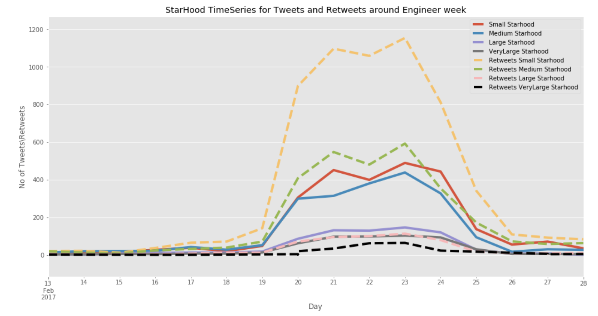

# Natural-Lang-Procs
This repository includes code and analysis for my research papers and also basic NLP models. 
Paper Links:
1. http://www.aies-conference.com/wp-content/papers/main/AIES_2018_paper_164.pdf
2. https://scholarspace.manoa.hawaii.edu/handle/10125/50161
 
Retweets and Tweets frequency based on Followers/Starhood: 

 
Topics discussed among Top 10 Users 

